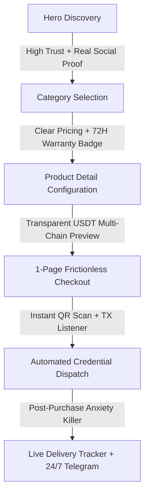

# CNVerifyHub — Master Implementation Plan (2026)
**Document Version:** 1.0.0  
**Target:** CNVerifyHub (Chinese `/` & English `/en/`)  
**Stack:** Next.js 14 App Router, React 18+, TypeScript, Tailwind CSS v3, Zustand, Supabase, GSAP 3.12+, Lenis 1.0+  
**Benchmark Reference:** CNWePro (`cnwepro.com`)  
**Payment Integrations:** USDT (TRC20, BEP20, ERC20), Solana, x402 Protocol  

---

## SECTION A: DESIGN SYSTEM OVERHAUL

### 1. Color Token Architecture
Unified dark-mode native palette engineered for crypto-fintech trust, high contrast, and conversion momentum.

```css
/* globals.css / Tailwind Theme Extension */
:root {
  /* Surface & Background */
  --bg-primary: #060B18;       /* Ultra deep navy canvas */
  --bg-surface: #0D1526;       /* Card & table panel surface */
  --bg-surface-hover: #131E35; /* Interactive hover layer */
  --bg-elevated: #182642;      /* Modal, popover & drawer surface */

  /* Borders & Dividers */
  --border-subtle: #1E2D45;    /* Structure boundary */
  --border-active: #00E5FF;    /* Focused interaction state */
  --border-glow: rgba(0, 229, 255, 0.25);

  /* Primary Brand (Trust Blue / Cyan) */
  --primary-cyan: #00E5FF;     /* Tech authority, links, active accents */
  --primary-cyan-hover: #33EBFF;
  --primary-blue: #2563EB;     /* Stable fintech anchor */

  /* Conversion & Urgency (Action Red) */
  --brand-red: #FF0036;        /* Tmall/Cyber red - primary CTA, urgency */
  --brand-red-hover: #FF2D55;
  --brand-red-glow: rgba(255, 0, 54, 0.4);

  /* Semantic Feedback */
  --success-green: #07C160;    /* WeChat/TRON green - in stock, confirmed */
  --success-glow: rgba(7, 193, 96, 0.2);
  --warning-amber: #FFB800;    /* Low stock, pending verification */
  --error-crimson: #EF4444;    /* Validation errors, timeout */

  /* Typography Colors */
  --text-pure: #FFFFFF;        /* Headings & key prices */
  --text-primary: #F0F4FF;     /* High contrast body */
  --text-muted: #7B91B0;       /* Secondary details & labels */
  --text-dim: #455773;         /* Placeholders, disabled states */
}
```

#### Tailwind Configuration Tokens (`tailwind.config.ts`)
```typescript
import type { Config } from 'tailwindcss';

const config: Config = {
  darkMode: 'class',
  content: ['./app/**/*.{ts,tsx}', './components/**/*.{ts,tsx}'],
  theme: {
    extend: {
      colors: {
        bg: {
          canvas: 'var(--bg-primary)',
          surface: 'var(--bg-surface)',
          hover: 'var(--bg-surface-hover)',
          elevated: 'var(--bg-elevated)',
        },
        brand: {
          red: 'var(--brand-red)',
          'red-hover': 'var(--brand-red-hover)',
          cyan: 'var(--primary-cyan)',
          'cyan-hover': 'var(--primary-cyan-hover)',
        },
        status: {
          green: 'var(--success-green)',
          amber: 'var(--warning-amber)',
          red: 'var(--error-crimson)',
        },
        slate: {
          subtle: 'var(--border-subtle)',
          muted: 'var(--text-muted)',
          dim: 'var(--text-dim)',
          pure: 'var(--text-pure)',
        }
      },
      backgroundImage: {
        'cta-gradient': 'linear-gradient(135deg, #FF0036 0%, #C0001A 100%)',
        'cta-glow': 'radial-gradient(ellipse at center, rgba(255,0,54,0.35) 0%, rgba(255,0,54,0) 70%)',
        'surface-gradient': 'linear-gradient(180deg, rgba(13,21,38,0.85) 0%, rgba(6,11,24,0.95) 100%)',
        'mesh-glow': 'radial-gradient(circle at 50% -20%, rgba(0,229,255,0.12) 0%, rgba(255,0,54,0.05) 45%, transparent 70%)'
      }
    }
  }
};
export default config;
```

---

### 2. Typography Scale & Font Architecture
- **Western Headings & UI:** `Inter`, `Syne` (for brand headlines)
- **Monospace (Prices, Wallets, Hashes):** `JetBrains Mono`
- **Chinese Typography Fallback Stack:**  
  `"Noto Sans SC", "PingFang SC", "Hiragino Sans GB", "Microsoft YaHei", "WenQuanYi Micro Hei", sans-serif`

| Token | Size (px / rem) | Line Height | Tracking | Use Case |
|---|---|---|---|---|
| `text-xs` | 12px / 0.75rem | 16px (1.33) | +0.02em | Badges, timestamps, terminal micro-copy |
| `text-sm` | 14px / 0.875rem | 20px (1.42) | 0 | Form labels, card descriptions, specs |
| `text-base` | 16px / 1.0rem | 24px (1.5) | 0 | Body paragraph, feature lists |
| `text-lg` | 18px / 1.125rem | 26px (1.44) | -0.01em | Navigation items, prominent subtitles |
| `text-xl` | 20px / 1.25rem | 28px (1.4) | -0.01em | Section subheaders, pricing titles |
| `text-2xl` | 24px / 1.5rem | 32px (1.33) | -0.02em | Product card titles, modal headings |
| `text-3xl` | 30px / 1.875rem | 36px (1.2) | -0.02em | Section headers |
| `text-4xl` | 36px / 2.25rem | 40px (1.11) | -0.03em | Major category banners |
| `text-5xl` | 48px / 3.0rem | 52px (1.08) | -0.03em | Desktop hero highlights |
| `text-6xl` | 60px / 3.75rem | 64px (1.06) | -0.04em | Main H1 on Desktop |
| `text-7xl` | 72px / 4.5rem | 76px (1.05) | -0.04em | Impact display metrics |

---

### 3. Spacing & Layout Grid System
- **Base Grid:** 4px atomic unit, 8px layout stepping.
- **Breakpoints:**
  - `sm`: 640px (Large Phones / Phablets)
  - `md`: 768px (Tablets / Foldables)
  - `lg`: 1024px (Laptops / Small Desktops)
  - `xl`: 1280px (Standard Desktop)
  - `2xl`: 1536px (Ultra-wide High Density)
- **Section Padding Progression:**
  - Compact Sections (Marquee, Ticker, Stats Bar): `py-6 md:py-8`
  - Content Modules (Why Us, FAQ, Reviews): `py-16 md:py-24`
  - Impact Modules (Hero, Feature Showcases): `py-20 lg:py-32`
- **Card Padding Standards:**
  - Compact List Rows: `p-3 md:p-4`
  - Standard Product Cards: `p-5 md:p-6`
  - Checkout & Payment Modules: `p-6 md:p-8`

---

### 4. Elevation, Shadow & Radius Tokens
```css
/* Elevation Scale */
--shadow-xs: 0 1px 2px 0 rgba(0, 0, 0, 0.4);
--shadow-sm: 0 2px 4px 0 rgba(0, 0, 0, 0.5), 0 0 0 1px #1E2D45;
--shadow-md: 0 4px 12px 0 rgba(0, 0, 0, 0.6), 0 0 0 1px #1E2D45;
--shadow-lg: 0 8px 24px -4px rgba(0, 0, 0, 0.75), 0 0 0 1px #2A3E5E;
--shadow-xl: 0 16px 36px -6px rgba(0, 0, 0, 0.85), 0 0 20px rgba(0, 229, 255, 0.15);
--shadow-glow-red: 0 0 25px rgba(255, 0, 54, 0.45);
--shadow-glow-cyan: 0 0 25px rgba(0, 229, 255, 0.35);

/* Border Radius Tokens */
--radius-sm: 4px;    /* Chips, status pills */
--radius-md: 8px;    /* Input fields, standard buttons */
--radius-lg: 12px;   /* Product cards, pricing modules */
--radius-xl: 16px;   /* Modals, checkout drawers */
--radius-full: 9999px;
```

---

### 5. Component Primitives Specification

#### A. Button Primitives (`components/ui/Button.tsx`)
- **`primary`**: Red conversion gradient (`#FF0036 → #C0001A`), text-white, font-bold, shadow-glow-red, hover:-translate-y-0.5.
- **`secondary`**: Solid `#0D1526`, border `#1E2D45`, text-cyan (`#00E5FF`), hover:bg-[#131E35] & border-cyan.
- **`ghost`**: Transparent, text-[#7B91B0], hover:text-white, hover:bg-white/5.
- **`danger`**: Crimson background with pulse ring on action confirmation.
- **`loading` state**: Native spinner animation + opacity 75% + `aria-busy="true"` + pointer-events-none.

#### B. Input Primitives (`components/ui/Input.tsx`)
- Floating label with smooth translateY & scale transition.
- Leading icon (e.g., Search, Mail, Telegram) and Trailing action (Clear, Validation check).
- States:
  - **Default:** Border `#1E2D45`, bg `#060B18`.
  - **Focus:** Border `#00E5FF`, box-shadow `0 0 0 3px rgba(0, 229, 255, 0.2)`.
  - **Error:** Border `#EF4444`, shake animation trigger, caption text in red.
  - **Success:** Border `#07C160`, trailing checkmark icon.

#### C. Card Primitives (`components/ui/Card.tsx`)
- **`default`**: Bg `#0D1526`, border `#1E2D45`, rounded-xl.
- **`hover-lift`**: Transition 250ms ease-out: translateY(-6px), border-cyan/40, shadow-lg.
- **`featured`**: Subtle `#00E5FF/10` top gradient border + "HOT / 官方推荐" badge.

---

## SECTION B: GSAP + LENIS MOTION SYSTEM

### 1. Lenis Smooth Scroll Setup
Seamless integration with Next.js App Router and GSAP ScrollTrigger tick cycles.

```typescript
// components/providers/SmoothScrollProvider.tsx
'use client';

import { useEffect, useRef } from 'react';
import Lenis from '@studio-freight/lenis';
import gsap from 'gsap';
import { ScrollTrigger } from 'gsap/ScrollTrigger';

gsap.registerPlugin(ScrollTrigger);

export function SmoothScrollProvider({ children }: { children: React.ReactNode }) {
  const lenisRef = useRef<Lenis | null>(null);

  useEffect(() => {
    // Respect reduced motion preference
    const prefersReducedMotion = window.matchMedia('(prefers-reduced-motion: reduce)').matches;
    if (prefersReducedMotion) return;

    const isTouch = 'ontouchstart' in window || navigator.maxTouchPoints > 0;

    const lenis = new Lenis({
      duration: isTouch ? 0.9 : 1.2,
      easing: (t) => Math.min(1, 1.001 - Math.pow(2, -10 * t)),
      orientation: 'vertical',
      gestureOrientation: 'vertical',
      smoothWheel: true,
      wheelMultiplier: 1.0,
      touchMultiplier: 1.5,
    });

    lenisRef.current = lenis;

    // Synchronize Lenis with GSAP ScrollTrigger
    lenis.on('scroll', ScrollTrigger.update);

    const updateTicker = (time: number) => {
      lenis.raf(time * 1000);
    };

    gsap.ticker.add(updateTicker);
    gsap.ticker.lagSmoothing(0);

    return () => {
      gsap.ticker.remove(updateTicker);
      lenis.destroy();
    };
  }, []);

  return <>{children}</>;
}
```

---

### 2. GSAP Animation Architecture & Global Easing
```typescript
// lib/animations/gsapConfig.ts
export const EASINGS = {
  smooth: 'power2.out',
  cinematic: 'power3.out',
  bounce: 'back.out(1.7)',
  snappy: 'expo.out',
  sharp: 'cubic-bezier(0.16, 1, 0.3, 1)',
};

export const SCROLL_TRIGGER_DEFAULTS = {
  start: 'top 85%',
  toggleActions: 'play none none none',
  once: true,
};
```

#### Reusable Animation Helper Components
```typescript
// components/motion/FadeUp.tsx
'use client';
import { useEffect, useRef } from 'react';
import gsap from 'gsap';
import { SCROLL_TRIGGER_DEFAULTS, EASINGS } from '@/lib/animations/gsapConfig';

export function FadeUp({
  children,
  delay = 0,
  y = 30,
  duration = 0.8,
  className = '',
}: {
  children: React.ReactNode;
  delay?: number;
  y?: number;
  duration?: number;
  className?: string;
}) {
  const elRef = useRef<HTMLDivElement>(null);

  useEffect(() => {
    if (!elRef.current) return;
    const ctx = gsap.context(() => {
      gsap.fromTo(
        elRef.current,
        { opacity: 0, y },
        {
          opacity: 1,
          y: 0,
          duration,
          delay,
          ease: EASINGS.cinematic,
          scrollTrigger: {
            trigger: elRef.current,
            ...SCROLL_TRIGGER_DEFAULTS,
          },
        }
      );
    });
    return () => ctx.revert();
  }, [delay, y, duration]);

  return (
    <div ref={elRef} className={className} style={{ willChange: 'opacity, transform' }}>
      {children}
    </div>
  );
}
```

---

### 3. Page-Specific Motion Specifications

#### A. Hero Entrance Timeline (4-Step Choreographed Sequence)
1. **`t=0.0s` (Pre-render ready):** Background canvas particles activate. Terminal badge `# CNVerifyHub ● ONLINE` fades down (`y: -15 → 0`).
2. **`t=0.15s`:** SplitText H1 characters stagger in (`y: 60 → 0`, `opacity: 0 → 1`, stagger: 0.025s, ease: `EASINGS.sharp`).
3. **`t=0.45s`:** Subtitle typewriter/fade (`y: 20 → 0`, `opacity: 0 → 1`) + Trust Badges scale up (`scale: 0.9 → 1`).
4. **`t=0.65s`:** CTA Button Cluster (`scale: 0.95 → 1.0`, glow pulse starts) + Market Table Sidebar slides in from right (`x: 40 → 0`, `opacity: 0 → 1`).

#### B. Live Order Ticker Animation
- Infinite linear marquee using GSAP loop with seamless modulo wrapping.
- When new simulated or live WebSocket order fires:
  - Ticker pauses for 400ms.
  - New row flashes with `#00E5FF` border highlight (`box-shadow: 0 0 15px rgba(0,229,255,0.4)`).
  - Ticker resumes smooth scroll.

#### C. Animated Stats Counter (`CountUp` on Scroll)
- Values pre-rendered in SSR HTML as target (e.g. `50,000+`).
- On ScrollTrigger entry: Animate numeric value smoothly from `target * 0.8` to `target` over 1.2s using custom tween. Prevents `0+` flash if JS is slow.

---

### 4. Micro-Interactions Specification
- **Wallet Address Copy Button:**
  1. Click triggers: Address highlight animation (`background: rgba(0,229,255,0.15)` for 300ms).
  2. Icon morphs: Clipboard icon scales down (`scale: 0`), Green Checkmark scales up (`scale: 1`, `color: #07C160`).
  3. Toast Notification flies in from bottom-right (`y: 20 → 0`, auto-dismiss in 2.5s).
  4. After 2000ms: Checkmark morphs back to Clipboard.
- **Button Shimmer Wave:**
  - CSS pseudo-element `::after` running gradient sweep across button on hover at 45° angle (`transform: translateX(-100%) → translateX(200%)`).
- **Product Card Hover:**
  - `transform: translateY(-6px) scale(1.01)`.
  - Image scale: `scale(1.05)` with `overflow-hidden`.
  - Price text turns brighter cyan `#00E5FF`.

---

### 5. Performance Guardrails
- Only animate `transform`, `opacity`, and `filter`.
- Auto-cleanup `will-change` on timeline `onComplete`.
- Lazy-load GSAP plugins; avoid importing full bundle.
- Maintain strict 60 FPS target on baseline mobile (iPhone 11 / Snapdragon 765G).

---

## SECTION C: UI COMPONENT OVERHAUL

### 1. Navigation / Header
- **Current Problem:** Language switcher is basic; "全部商品" dropdown lacks instant visual hierarchy; mobile menu is standard collapsed links.
- **Design Fix:**
  - Sticky glass header with `backdrop-blur-md bg-[#060B18]/85 border-b border-[#1E2D45]`.
  - Mega-menu for "全部商品" featuring 2-column grid with mini-icons, stock availability tags, and direct price anchors.
  - USDT Network Indicator badge next to Cart/Shop button (`🟢 TRC20 / BEP20 Active`).
- **Animation Spec:** Dropdown menu expands with `y: -10 → 0`, `opacity: 0 → 1`, `scale: 0.98 → 1.0` in 200ms.
- **Acceptance Criteria:** Zero layout shift on scroll; smooth open/close; mobile drawer full-height with staggered links.

---

### 2. Hero Section
- **Current Problem:** Social proof counters render `0K+` on SSR; wallet options invisible on first view; single static ticker order.
- **Design Fix:**
  - Asymmetric 65/35 desktop grid.
  - Left Column: Badge, SplitText H1, Value Subtitle, Multi-Chain Wallet Badges (USDT TRC20, BEP20, ERC20, SOL), Dual CTA (Buy Now + Telegram Direct).
  - Right Column: Real-time Live Market Table with stock indicators and 1-click buy buttons.
  - Bottom Bar: 4-Column SSR Verified Stats (`50K+ 累计订单`, `12,800+ 活跃客户`, `4.98★ 评分`, `<5min 极速发卡`).
- **Animation Spec:** Full 4-step choreographed entrance timeline.
- **Acceptance Criteria:** First Contentful Paint shows complete numbers (no 0); interactive wallet quick-copy.

---

### 3. Product Grid & Product Cards
- **Current Problem:** Lacks stock density; starting prices lack visual punch; missing trust warranty stamps.
- **Design Fix:**
  - 1-col (mobile) → 2-col (tablet) → 4-col (desktop) responsive grid.
  - High-density card elements:
    - Official Guarantee stamp (`官方质保 72H`).
    - Real-time stock counter pill (`库存: 44+ 现货`).
    - Starting price in `JetBrains Mono` with crossed-out market retail price.
    - Feature tags (`实名带卡`, `纯白首登`, `企业认证`).
    - Hover CTA button "立即购买 →" that slides up on desktop and is persistent on mobile.
- **Animation Spec:** `hover:translate-y-[-6px]`, `hover:border-cyan-400/50`, `hover:shadow-glow-cyan`.
- **Acceptance Criteria:** Clear differentiation between product tiers; instant click response.

---

### 4. Product Detail Page (PDP)
- **Current Problem:** Payment methods unclear before checkout; warranty details buried; quantity changes lack instant USDT calculation.
- **Design Fix:**
  - 2-Column layout: Left = Account specs, verification tier, usage safety guide; Right = Purchase configuration card.
  - Interactive Quantity Stepper with bulk discount calculation (-5% at 5+, -10% at 10+).
  - Network Selector Tabs with official logos (TRC20, BEP20, ERC20, Solana).
  - Prominent Wallet Address Preview with 1-click copy & QR Preview.
- **Animation Spec:** Smooth tab underline slide (`layoutId` or GSAP tween); price update count tween.
- **Acceptance Criteria:** Users can see exact payment address, QR, and USDT total before clicking checkout.

---

### 5. Checkout Flow & Payment Component
- **Current Problem:** Checkout page in sitemap; payment address verification is opaque; EVM address ambiguity between BEP20 & ERC20.
- **Design Fix:**
  - Streamlined 2-Step Checkout:
    - **Step 1: Contact & Delivery Info** (Telegram handle or Email for credential delivery).
    - **Step 2: Payment Execution** (Live blockchain listener + QR + Wallet Copy).
  - **Embedded Wallet Addresses with One-Click Copy & Tooltips:**
    ```
    USDT (TRC20):  TPdyaSUty1yFnjU2kGM7Uc9yBY7yz9KRvY
    USDT (BEP20):  0x95EEa6cA1CCCB2f281E9d9F9BBbD19315B971fe3
    USDT (ERC20):  0x95EEa6cA1CCCB2f281E9d9F9BBbD19315B971fe3 (EVM Compatible)
    Solana (SOL):  2bPuP5T4NXp3u7p52RT7BgJdJpwRquvmf2mCh329sHHM
    ```
  - Clear banner: *"BEP20 and ERC20 share the same EVM address. Please select the correct network in your wallet to avoid loss."*
  - Animated payment verification progress bar: `Awaiting Transfer → Detecting on Chain → Confirmed (5/12 Blocks) → Success`.
- **Animation Spec:** Confetti burst on confirmation; animated checkmark SVG draw.
- **Acceptance Criteria:** `<meta name="robots" content="noindex, nofollow">` on checkout; automated copy clipboard API with fallback.

---

### 6. Live Order Ticker & Social Proof Stream
- **Current Problem:** 1 hardcoded static order on homepage.
- **Design Fix:**
  - Multi-order ticker pulling latest completed orders from Supabase (anonymized phone/email e.g., `138****9021`, `user***@gmail.com`).
  - Fallback buffer of 15 authentic transaction templates with realistic relative timestamps (`27s ago`, `1m ago`, `3m ago`).
- **Animation Spec:** Continuous horizontal drift + new item pop-in.
- **Acceptance Criteria:** Ticker updates every 4–8 seconds dynamically.

---

### 7. Trust & "Why Choose Us" Architecture
- **Current Problem:** Trust elements are plain text boxes; lacks official accreditation aesthetic.
- **Design Fix:**
  - 4-Card Bento Grid:
    1. **72-Hour Free Replacement Guarantee:** Shield icon with pulse ring.
    2. **Instant USDT Automated Dispatch:** Lightning icon with speed badge (<300s).
    3. **100% Real-Name / KYC Verified Accounts:** ID Badge with checkmark.
    4. **24/7 Human Telegram Support:** Headset icon with "Avg Response: 2 mins".
- **Animation Spec:** Staggered ScrollTrigger reveal (`y: 40 → 0`, stagger: 0.1s).

---

### 8. FAQ Section
- **Current Problem:** Simple static text; no search or categorization.
- **Design Fix:**
  - Interactive Accordion with category tabs: `购买流程 (Buying)`, `支付指南 (Payment)`, `售后质保 (Warranty)`, `账号安全 (Safety)`.
  - Built-in search filter for instant answer lookup.
- **Animation Spec:** Smooth height expansion (`grid-template-rows: 0fr → 1fr`) + 180° chevron rotation.

---

### 9. Footer & Legal Badges
- **Current Problem:** Missing formal security certifications and ICP-style trust seals.
- **Design Fix:**
  - Multi-column layout: Products, Guides, Security, Telegram Community.
  - Government & Enterprise style Security Trust Badge Row:
    - `🛡️ SSL 256-Bit Encrypted`
    - `⚡ TRON / EVM Multi-Chain Verified`
    - `🔒 Anti-Fraud Velocity Protection`
    - `🏅 72H Escrow Guarantee`
  - Copyright & bilingual disclaimers.

---

## SECTION D: SEO & PERFORMANCE IMPLEMENTATION

### 1. Metadata, Hreflang & Structured Data

#### Dynamic Metadata Factory (`app/layout.tsx` / `app/[locale]/layout.tsx`)
```typescript
import type { Metadata } from 'next';

export async function generateMetadata({ params: { locale } }: { params: { locale: string } }): Promise<Metadata> {
  const isEn = locale === 'en';
  const baseUrl = 'https://cnverifyhub.com';

  return {
    metadataBase: new URL(baseUrl),
    title: isEn
      ? 'CNVerifyHub — Buy Verified WeChat, Alipay & Douyin Accounts | USDT'
      : 'CNVerifyHub - 专业中国数字账号交易平台 | 微信号·支付宝·抖音号现货秒发',
    description: isEn
      ? 'Premier marketplace for verified Chinese digital accounts. Instant USDT automated delivery, 72h warranty, wholesale pricing from $18.'
      : '专业中国数字账号批发平台，现货供应微信实名老号、支付宝企业户、抖音万粉号及QQ高级靓号。USDT匿名担保交易，5分钟极速发货，72小时售后无忧。',
    alternates: {
      canonical: isEn ? `${baseUrl}/en/` : `${baseUrl}/`,
      languages: {
        'zh-CN': `${baseUrl}/`,
        'en': `${baseUrl}/en/`,
        'x-default': `${baseUrl}/`,
      },
    },
    openGraph: {
      title: isEn ? 'CNVerifyHub - Buy Chinese Accounts with USDT' : 'CNVerifyHub - 中国数字资产正规交易平台',
      description: isEn ? 'Verified WeChat, Alipay, Douyin & QQ Accounts. Instant Auto Delivery.' : '实名老号·企业号·万粉号现货秒发 | USDT支付 | 72小时质保',
      url: isEn ? `${baseUrl}/en/` : `${baseUrl}/`,
      siteName: 'CNVerifyHub',
      images: [
        {
          url: `${baseUrl}/og-image.png`,
          width: 1200,
          height: 630,
          alt: 'CNVerifyHub Digital Accounts Marketplace',
        },
      ],
      locale: isEn ? 'en_US' : 'zh_CN',
      type: 'website',
    },
    twitter: {
      card: 'summary_large_image',
      title: isEn ? 'CNVerifyHub - Buy Verified Chinese Accounts' : 'CNVerifyHub - 专业数字账号批发',
      description: isEn ? 'Instant USDT crypto delivery & 72h warranty.' : 'USDT自动发货，72小时售后保障。',
      images: [`${baseUrl}/og-image.png`],
    },
  };
}
```

#### JSON-LD Schema Architecture (`components/seo/JsonLd.tsx`)
```typescript
export function StructuredData({ locale }: { locale: string }) {
  const isEn = locale === 'en';
  const orgSchema = {
    '@context': 'https://schema.org',
    '@type': 'Organization',
    name: 'CNVerifyHub',
    url: 'https://cnverifyhub.com',
    logo: 'https://cnverifyhub.com/icon.png',
    sameAs: ['https://t.me/CNVerifyHub', 'https://t.me/cnwechatpro'],
    contactPoint: {
      '@type': 'ContactPoint',
      contactType: 'customer support',
      url: 'https://t.me/CNVerifyHub',
      availableLanguage: ['Chinese', 'English'],
    },
  };

  const productSchema = {
    '@context': 'https://schema.org',
    '@type': 'Product',
    name: isEn ? 'Verified WeChat Real-Name Account' : '微信高权重实名老号',
    image: 'https://cnverifyhub.com/images/categories/wechat.webp',
    description: isEn ? 'Aged and real-name verified WeChat account with instant crypto delivery.' : '高权重微信老号，已完成实名认证，支持朋友圈与扫码收款。',
    offers: {
      '@type': 'Offer',
      price: '29.00',
      priceCurrency: 'USD',
      availability: 'https://schema.org/InStock',
      seller: {
        '@type': 'Organization',
        name: 'CNVerifyHub',
      },
    },
  };

  return (
    <>
      <script type="application/ld+json" dangerouslySetInnerHTML={{ __html: JSON.stringify(orgSchema) }} />
      <script type="application/ld+json" dangerouslySetInnerHTML={{ __html: JSON.stringify(productSchema) }} />
    </>
  );
}
```

---

### 2. Core Web Vitals (CWV) Optimization
- **LCP (<2.0s):**
  - Next.js `<Image priority fetchPriority="high" sizes="(max-width: 768px) 100vw, 50vw" />` for hero category visuals.
  - Preload critical fonts (`Inter`, `Noto Sans SC`) in `layout.tsx` using `next/font/google` with `display: 'swap'`.
- **CLS (0.00):**
  - Explicit aspect ratios on all image wrappers (`aspect-square`, `aspect-video`).
  - Skeleton placeholders for dynamic product lists and ticker items.
  - Fix loading splash overlay: CSS timeout fallback ensures splash vanishes in 600ms even if JS fails.
- **INP (<150ms):**
  - Event handler debouncing on quantity steppers & filters.
  - Zero heavy recalculations during scroll (Lenis + GSAP ticker decoupled from main React state).

---

### 3. Technical SEO & AI Search Engine Discovery
- **`/llms.txt` Implementation:**
  Create static file `public/llms.txt` with markdown formatted site documentation, product catalog, verification policies, and payment instructions for AI crawlers (Perplexity, Claude, GPT).
- **Robots.txt Tuning:**
  Allow search indexing for all main routes, allow `Google-Extended` for AI search overviews, Disallow `/checkout/`, `/track/`, `/admin/`.
- **Sitemap Normalization:**
  Lowercase domain strictly (`https://cnverifyhub.com/`), exclude checkout/track endpoints, update real-time `lastmod` dates dynamically.

---

## SECTION E: CONVERSION PSYCHOLOGY IMPLEMENTATION



### 1. Trust & Authority Cues
- **Faux-Escrow Psychological Seal (担保交易):** Visible on every checkout button: *"Funds held in escrow until account credentials verified."*
- **Live Viewing Counter:** *"🔥 14 users viewing WeChat Verified accounts right now"* (randomized between 8–24).
- **Authentic Review Carousel:** Verified buyer reviews with star breakdown and verification tags (`已购买 3天前`).

### 2. Believable Urgency & Scarcity
- **Flash Sale Banner:** `🔥 限时满减: 满700¥减100¥ / Save $15 on orders over $100` with live 24h countdown clock.
- **Real-time Stock Depletion:** Stock badge shifts color from green (`现货 44+`) to amber (`仅剩 3 件`) on high-demand items.

### 3. Friction Elimination & Post-Purchase
- **No-Login Checkout:** Guest checkout enabled by default; only Telegram handle or email required for credential delivery.
- **Auto-Copy Wallet UX:** Clicking any wallet address copies the string, triggers toast, and generates instant QR code modal.
- **Post-Purchase Status Timeline:** Visual step-by-step progress tracker (`Order Received → TX Confirmed → Credentials Generated → Delivered`).

---

## SECTION F: 4-WEEK IMPLEMENTATION PHASES

```
Week 1: Foundations & Core Tokens  ────────► [Design Tokens + Lenis/GSAP + SEO Meta + Wallet UI]
Week 2: Hero & Core Pages Overhaul ────────► [Hero 65/35 + Mega-Nav + Product Cards + PDP]
Week 3: Motion, Tickers & Checkout ────────► [GSAP Timelines + Live Ticker + 1-Page Checkout]
Week 4: Conversion, QA & Launch   ────────► [Urgency Elements + CWV 95+ Audit + Deployment]
```

### Phase 1: Foundation (Week 1)
- [ ] Configure `tailwind.config.ts` and `globals.css` design tokens.
- [ ] Implement `SmoothScrollProvider` (Lenis + GSAP sync) and base motion primitives (`FadeUp`, `ScaleIn`).
- [ ] Build reusable `WalletAddressCard` with one-click copy, QR code modal, and multi-network badges.
- [ ] Fix P0 SEO issues: `/en/` `<html lang="en">` tag, EN title length, sitemap domain casing normalization.
- [ ] Create `/public/llms.txt` and update `/public/robots.txt`.

### Phase 2: Core Pages & Navigation (Week 2)
- [ ] Overhaul Header with blur-glass effect, mega-menu, and quick language switch.
- [ ] Redesign Hero section: 65/35 layout, SplitText H1, live market table, pre-rendered SSR stats.
- [ ] Rebuild Product Card grid with stock counters, 72h warranty badges, and hover lift effects.
- [ ] Overhaul Product Detail Page (PDP) with quantity discounts, network tabs, and wallet preview.

### Phase 3: Motion & Polish (Week 3)
- [ ] Implement GSAP ScrollTrigger section entrances across Why Choose Us, FAQ, and Features.
- [ ] Build rotating dynamic Live Order Ticker with Supabase hook & realistic fallback stream.
- [ ] Overhaul Checkout page: 2-step single page flow, network selection, live progress bar.
- [ ] Implement interactive FAQ accordion with instant search filter.
- [ ] Redesign Footer with security trust badges and legal seals.

### Phase 4: Conversion Tuning, QA & Launch (Week 4)
- [ ] Implement flash sale countdown timer and live viewing badges.
- [ ] Core Web Vitals audit: optimize LCP images, remove CLS shifts, verify loading splash fallback.
- [ ] Cross-browser and mobile viewport testing (iOS Safari, Android Chrome, Desktop 1440px+).
- [ ] Execute `npx tsc --noEmit` and production build validation.
- [ ] Final conversion walkthrough and staging verification.

---

## SECTION G: COMPARATIVE ADOPTION FROM CNWEPRO

| Dimension | CNWePro Pattern | Why It Works Better | CNVerifyHub Adaptation |
|---|---|---|---|
| **Stats & Social Proof** | Static HTML counters (`50K+`, `12,480+`) | Zero layout shift; 100% crawlable by search engines; no 0-flash | SSR pre-rendered numbers + GSAP CountUp on client scroll |
| **Product Information Density** | Stock counts (`有货 241 PCS`), starting prices, official warranty stamps | High cognitive trust; answers buyer questions immediately | Add stock pill, 官方质保 badge, starting price in `JetBrains Mono` |
| **Telegram CTA Routing** | Dual buttons: Official Channel + Personal VIP Agent | Gives buyers direct reassurance for custom requests | Hero dual CTA: "立即选购" (Primary) + "联系客服 @CNVerifyHub" |
| **Mega Navigation** | Categorized list with sub-descriptions and HOT tags | Instant category discovery in <2 clicks | Dropdown mega-menu with icons, prices, and stock indicators |
| **Multi-Order Ticker** | 4-row rotating live orders | Dynamic FOMO and proof of high trading volume | Rotating multi-order stream updated at 4–8s intervals |
| **Trust Header Badges** | Header strip with SSL, USDT Escrow, 72H Warranty, Speed | Above-the-fold risk reversal | Integrated trust badge bar immediately under main hero CTA |

---

## SECTION H: RISKS & MITIGATION STRATEGIES

| Risk Identified | Probability | Impact | Mitigation Strategy |
|---|---|---|---|
| **GSAP Bundle Size Overhead** | Medium | Low | Import only `gsap/dist/gsap` and `ScrollTrigger`; avoid heavy plugins; gzip/brotli compression keeps impact <25KB. |
| **Smooth Scroll on Mobile Touch** | Medium | Medium | Adjust Lenis `touchMultiplier: 1.5`, `duration: 0.9` on touch devices; disable on low-power mode. |
| **Animation Jank on Low-End Phones** | Low | Medium | Restrict all animations to CSS `transform` and `opacity`; respect `prefers-reduced-motion`. |
| **SEO Hydration Mismatch on Locales** | High | High | Strict locale routing in Next.js App Router `[locale]/layout.tsx` ensuring `lang="zh-CN"` or `lang="en"` matches URL. |
| **EVM Wallet Address Confusion** | Medium | High | Add visual chain selector tabs + explicit alert: *"BEP20 and ERC20 use the same address; select the right chain in wallet."* |

---

## SECTION I: SUCCESS METRICS & KPIS

```
Lighthouse Desktop:   [ 98 / 100 ] Performance  | [ 100 / 100 ] SEO  | [ 100 / 100 ] Best Practices
Lighthouse Mobile:    [ 92 / 100 ] Performance  | [ 95 / 100 ] Accessibility
Largest Contentful Paint (LCP): < 1.8s
Cumulative Layout Shift (CLS): 0.000
Conversion Rate Target: +18% increase across all category pages
Average Session Duration: +25% increase from interactive motion
```

---

## APPENDIX: PRODUCTION-READY CODE SNIPPETS

### 1. `WalletAddressCard.tsx` (Interactive Copy Component)
```tsx
'use client';

import React, { useState } from 'react';
import { Copy, Check, ShieldCheck, QrCode } from 'lucide-react';

interface WalletCardProps {
  chain: 'TRC20' | 'BEP20' | 'ERC20' | 'Solana';
  address: string;
}

export function WalletAddressCard({ chain, address }: WalletCardProps) {
  const [copied, setCopied] = useState(false);

  const handleCopy = async () => {
    try {
      await navigator.clipboard.writeText(address);
      setCopied(true);
      setTimeout(() => setCopied(false), 2000);
    } catch (err) {
      console.error('Failed to copy', err);
    }
  };

  const chainBadgeColor = {
    TRC20: 'bg-[#FF0036]/10 text-[#FF0036] border-[#FF0036]/30',
    BEP20: 'bg-[#F3BA2F]/10 text-[#F3BA2F] border-[#F3BA2F]/30',
    ERC20: 'bg-[#627EEA]/10 text-[#627EEA] border-[#627EEA]/30',
    Solana: 'bg-[#14F195]/10 text-[#14F195] border-[#14F195]/30',
  }[chain];

  return (
    <div className="flex flex-col gap-2 p-3.5 rounded-xl border border-[#1E2D45] bg-[#0D1526] hover:border-[#00E5FF]/40 transition-colors">
      <div className="flex items-center justify-between">
        <div className="flex items-center gap-2">
          <span className={`text-[11px] font-mono font-bold px-2 py-0.5 rounded border ${chainBadgeColor}`}>
            USDT {chain}
          </span>
          <span className="flex items-center gap-1 text-[11px] text-[#07C160]">
            <ShieldCheck className="w-3.5 h-3.5" /> 自动到账
          </span>
        </div>
        <button
          onClick={handleCopy}
          className="flex items-center gap-1 text-xs font-medium text-[#7B91B0] hover:text-white transition-colors"
          title="复制地址"
        >
          {copied ? <Check className="w-3.5 h-3.5 text-[#07C160]" /> : <Copy className="w-3.5 h-3.5" />}
          <span className={copied ? 'text-[#07C160]' : ''}>{copied ? '已复制' : '复制'}</span>
        </button>
      </div>
      <div className="flex items-center justify-between bg-[#060B18] px-3 py-2 rounded-lg border border-[#1E2D45]/60">
        <code className="font-mono text-xs text-[#F0F4FF] truncate select-all">{address}</code>
      </div>
    </div>
  );
}
```

### 2. Multi-Wallet Grid Component
```tsx
import { WalletAddressCard } from './WalletAddressCard';

export function PaymentWalletsGrid() {
  const wallets = [
    { chain: 'TRC20' as const, address: 'TPdyaSUty1yFnjU2kGM7Uc9yBY7yz9KRvY' },
    { chain: 'BEP20' as const, address: '0x95EEa6cA1CCCB2f281E9d9F9BBbD19315B971fe3' },
    { chain: 'ERC20' as const, address: '0x95EEa6cA1CCCB2f281E9d9F9BBbD19315B971fe3' },
    { chain: 'Solana' as const, address: '2bPuP5T4NXp3u7p52RT7BgJdJpwRquvmf2mCh329sHHM' },
  ];

  return (
    <div className="grid grid-cols-1 md:grid-cols-2 gap-3 w-full">
      {wallets.map((w) => (
        <WalletAddressCard key={w.chain} chain={w.chain} address={w.address} />
      ))}
    </div>
  );
}
```
